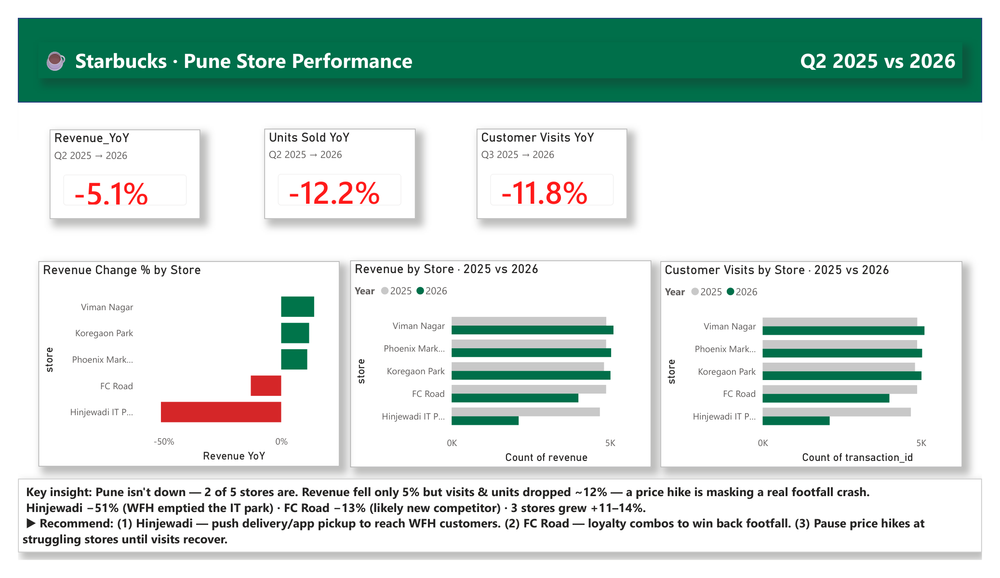

# Starbucks · Pune Store Performance Dashboard (Power BI)

A self-directed **Power BI case study**: a simulated VP of Operations asks *"Pune store sales dipped last quarter — why, and what should we do?"* This project answers it end-to-end, following the full analyst workflow (**Ask → Prepare → Process → Analyze → Share → Act**).

## The business question
> "Pune store sales dipped last quarter — why, and what do we do about it?"

## Key findings
- **Revenue fell only 5.1%** — but **units sold (−12.2%)** and **customer visits (−11.8%)** dropped ~12%. An **8% price increase masked a real footfall crash.**
- The decline was **concentrated in 2 of 5 stores — not city-wide:**
  - **Hinjewadi IT Park −51%** — WFH emptied the IT-park footfall
  - **FC Road −13%** — likely a new nearby competitor
  - The other **3 stores grew +11–14%**
- Two independent metrics (revenue *and* visits) tell the same store-by-store story → a robust, defensible conclusion.

## Recommendations
1. **Hinjewadi** — push delivery / app pickup to reach the work-from-home crowd.
2. **FC Road** — loyalty combos to win footfall back from the competitor.
3. **Pause further price hikes** at the struggling stores until visits recover.

## Built with
- **Power BI Desktop** — KPI cards, conditional formatting (red = decline / green = growth), executive layout
- **Power Query** — ETL (typed data, engineered `revenue` and `year` columns)
- **DAX** — `CALCULATE` with year filters, `DISTINCTCOUNT` (unique visits), `DIVIDE` (safe YoY %)
- **Python (pandas)** — synthetic data generation + exploratory analysis

## Files
| File | What it is |
|---|---|
| `starbucks_dashboard.png` / `Starbucks_Dashboard.pdf` | The finished dashboard |
| `generate_data.py` | Generates the synthetic dataset |
| `starbucks_sales.csv` | 45,440 transactions · Q2 2025 vs Q2 2026 · 5 Pune stores |
| `starbucks_analysis.py` | Exploratory Python analysis (pandas) |

## Note on the data
The dataset is **synthetic** — generated by `generate_data.py` for this case study. It is **not** real Starbucks data.
